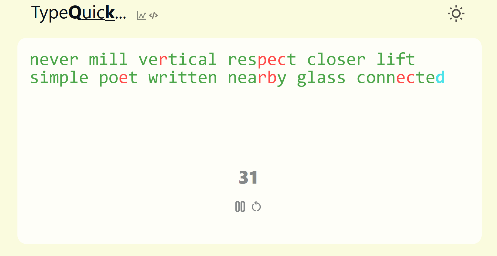
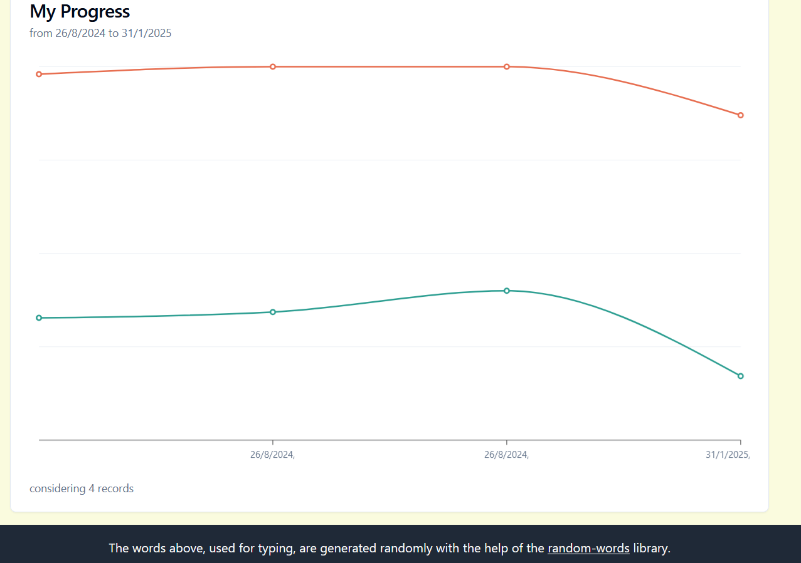

# TypeQuick - A React-Based Typing Project

TypeQuick is a simple yet effective typing practice application built using React. This project helps users improve their typing speed and accuracy while tracking progress over time. The data is stored on the client side using local storage.

## Features
- Random word generation for typing practice
- Real-time accuracy feedback with color indicators
- Progress tracking over time with visual charts
- Local storage support for saving user data
- Light and dark mode support

## Screenshots
### Typing Interface

### Progress Tracking

### Technologies used
- React.js
- TailwindCSS
- chart.js
